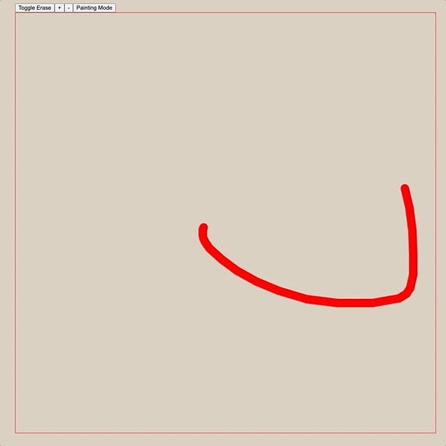

<a href="https://mighty.business">
 
</a>
<h1 align='center'>Mighty - Hackathon </h1>

## Tilable Background Builder

During a company wide hackathon, I developed proto type of an application that allow you to easily draw/paint tilable backgrounds. As long as you don't draw on the border, you can move your painting arround, to deal with seams. 

### `npm start`

Runs the app in the development mode.
Open [http://localhost:3000](http://localhost:3000) to view it in your browser.

## Demo

